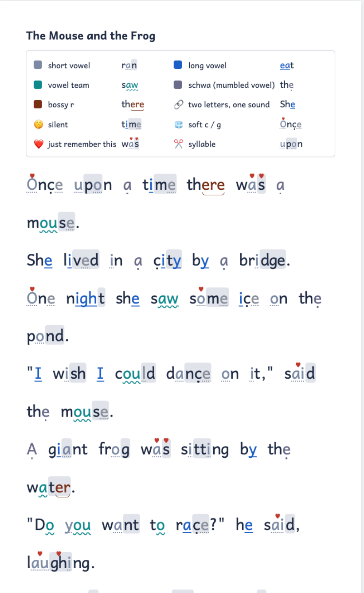
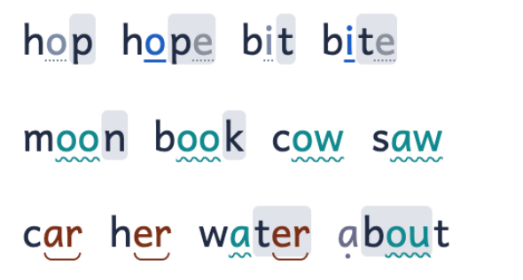
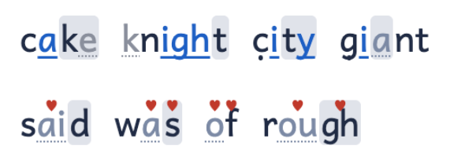
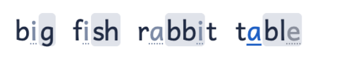

# Color Reader

**Try it: <https://ianb.github.io/color-reader/>**

A tool for making printable reading pages for very beginning readers. Paste in a
story, and it comes back with the letters lightly marked up so a child can see
how each word is meant to be sounded out — and with a key on the same page so
they (or the adult next to them) never have to remember the system.

It is meant to be printed. Screens work too, but paper is the point.



## The idea

English letters get you close to the word, but they aren't enough to actually
decode it. A beginning reader who knows the letter sounds still has to know
that the *o* in *hop* and the *o* in *hope* are different sounds, that *bit*
and *bite* don't rhyme, that the *c* in *cat* and the *c* in *city* aren't the
same — and that *said*, *night* and *once* can't really be sounded out at all.
Most of what the adult helping does, when reading with a beginning reader, is
supply that missing bit — sometimes on every single word.

Color Reader doesn't try to fix this by changing the letters, inventing new
ones, or controlling which words are allowed. It leaves the text alone and adds
a little extra information on top: the same information the helper would be
supplying out loud.

- **How to chunk the word.** Take *big*. If the child says *buh*, then *ih*,
  then *guh*, those three pieces don't go back together into *big* — the
  extra *uh* sounds get in the way. It works much better to read *bi* as one
  piece and then add the *g*. Starting with a lone consonant is a bad
  pattern, but it is what almost everyone does by instinct, and the helper
  ends up fighting it with every child. Syllables aren't quite the right unit
  either. So the page shows a chunking — by default consonant-plus-vowel,
  then what's left — with light shading.
- **Which sound the vowel is making.** Vowels are badly overloaded. The page
  marks them consistently: nothing for the ordinary short sound, and a small
  set of marks for the long sound, vowel teams, the "bossy r" combinations,
  and the schwa — the mumbled vowel in the *a* of *about* or the *o* of
  *button*. The same mark means the same thing whatever the spelling.
- **Alternate consonants.** Consonants do this too, less often — the two
  *c*'s, the two *g*'s — and those get a mark.
- **Words that just don't work.** Some words can't be decoded; they have to
  be learned. These are usually called *sight words* or *heart words*. They
  get a heart on the letter that misbehaves, so there's at least an awareness
  that this one is different, and a small list on the page spelling out how
  each one actually sounds.
- **A key, on every page.** The page carries its own key, built from the
  words on that page, so that one page has everything needed to read that
  one page. The key is really for the adult helping; the heart-word list is
  something the child can actually use.

There are other markup schemes like this. This one is not proprietary; it is
dynamic — not a set of specific readers, but something you can paste any text
into and get a self-explaining page out of, ideally printed; and it is a
starting point for further experimentation rather than a fixed system. It also
combines a few things the author has found helpful but hasn't seen together.

The easiest way to understand it is to **[open the site](https://ianb.github.io/color-reader/)**
and look — there's nothing hidden, though it may not be self-explanatory at
first glance.

This is an experiment, and an early one: it hasn't been tried with a child yet.
I hope to do that some, with kids in my life, but I'm not a pedagogical
professional of any kind.

— Ian Bicking

## What the marks mean

**Vowels.** Underlines describe what a vowel is doing:



- no mark — a short vowel saying its usual sound (*cat*, *pond*). Optionally, a
  faint dotted underline for the very first weeks.
- straight underline — a long vowel: *she*, *time*, *rain*, *night*.
- wavy underline — a vowel team with its own sound: *moon*, *book*, *cow*,
  *boy*, *saw*, *you*.
- bracket beneath — "bossy r": the vowel-plus-*r* unit in *car*, *for*, *her*,
  *bird*, *water*.
- small dot beneath — a schwa, the mumbled vowel in *upon*, *about*, *the*.

By default the vowel is also tinted by that same family (long, team, bossy r,
schwa). You can switch the tint off, or switch to one color per vowel sound if
you want to experiment.

**Consonants and silent letters.**



- Two letters that make one sound (*sh*, *ch*, *th*, *ck*, *ng*, *tch*, *dge*)
  are set very slightly closer together — something felt rather than read.
- Silent letters are grayed out with a dotted underline: the *e* in *cake*, the
  *k* in *knight*, the *l* in *could*.
- A soft *c* or *g* (*city*, *ice*, *giant*) gets a small mark below.
- A **heart** sits over a letter that is simply doing the wrong thing and has to
  be memorized: the *ai* in *said*, the *a* in *was*, the *f* in *of* (which
  says *v*), the *gh* in *rough*.

**Chunks.** Each word is broken into decoding chunks shown by alternating white
and light-gray shading, always starting white.


 The default chunking is
"body + coda": the consonant is kept attached to the vowel that follows it —
*ca·t*, *fi·sh*, *ra·bbi·t* — because a child who sounds out "buh–ih–guh"
inserts vowels that aren't there, while "bi" then "g" doesn't have that problem.
Syllable and onset–rime chunking are available as alternatives, along with a
plain gap instead of shading.

**Typography.** Large type (about 22pt), wide word spacing, generous line
spacing, and short lines that you control with line breaks. The face is Andika,
SIL's literacy font, chosen for its clear letter shapes and for letters that
follow handwriting conventions.

## The keys

Every page carries its own key, built from the words on that page. Each row of
the key shows one cue (long vowel, silent letter, soft *c*, …) with an example
word chosen from the text — preferably a plain word that shows only that one
thing, and never a one- or two-letter word. Because the examples are words the
child is about to read, reading the key aloud doubles as a warm-up. The meaning
of each mark never changes from page to page; only the examples do.

Below the story, a second small key lists the heart words on the page with a
sound-it-out respelling: *said → sed*, *was → wuz*, *of → uv*, *once → wuns*,
*laughing → lafing*. The respelling is itself marked up, so the child can decode
it with the same rules and then match it to the real word.

There is also a **Full key** view — a printable reference sheet of every vowel
sound, its mark, and its common spellings, plus the consonant marks — and a
**Proof sheet** showing every letter grouping in context, for tuning the
typography.

## Where the word knowledge comes from

Roughly eight hundred common words — the Dolch and Fry sight-word lists, the
words used in early phonics sequences, and everyday child vocabulary — are
marked up by hand: syllable breaks, which letters form a unit, what sound each
vowel makes, what is silent, what needs a heart. Words outside that list are
decoded by rules (digraphs, magic-*e*, vowel teams, open and closed syllables,
common endings). Rule-decoded words are usually right for regular spellings and
can be wrong for irregular ones; a debugging option marks them so they can be
checked and added to the hand list.

Syllable splits follow decoding conventions rather than dictionary hyphenation
(*rab-bit*, *ti-ger*, *ta-ble*), so that the split explains the vowel: an open
syllable ends in a vowel, and that vowel is long.

## Development

```sh
npm install
npm run dev      # local dev server
npm test
npm run build    # -> dist/
```

Pushing to `main` deploys to GitHub Pages automatically. The hand-authored word
list lives in `src/lexicon/` in a compact notation documented in
`src/lexicon/notation.ts`.
